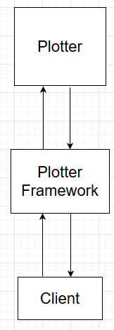
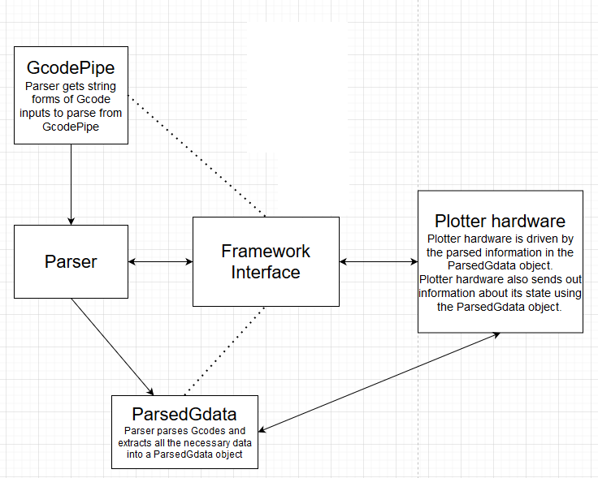

The GCodeParser ios a part of a Metropolia fall 2020 project, to build a framework for a plotter machine:
 

 
The framework itself consists of the parser, a "Gcode pipe" through which the Gcodes are given and an interface to manipulate the framework:

